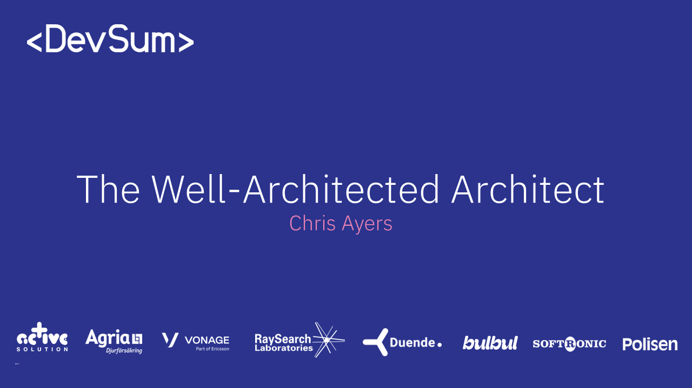
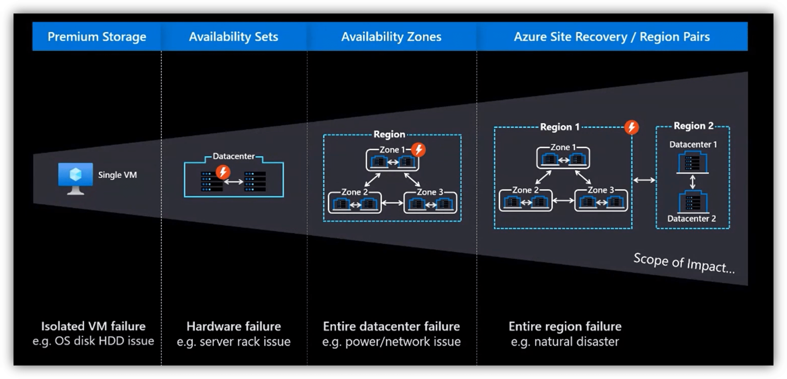

---

# The Well-Architected Architect

## Modernizing Cloud Excellence in 2025

## Chris Ayers


---


## Chris Ayers

_Senior Site Reliability Engineer_
_Azure CXP AzRel_
_Microsoft_

<i class="fa-brands fa-bluesky"></i> BlueSky: [@chris-ayers.com](https://bsky.app/profile/chris-ayers.com)  
<i class="fa-brands fa-linkedin"></i> LinkedIn: - [chris\-l\-ayers](https://linkedin.com/in/chris-l-ayers/)  
<i class="fa fa-window-maximize"></i> Blog: [https://chris-ayers\.com/](https://chris-ayers.com/)  
<i class="fa-brands fa-github"></i> GitHub: [Codebytes](https://github.com/codebytes)  
<i class="fa-brands fa-mastodon"></i> Mastodon: [@Chrisayers@hachyderm.io](https://hachyderm.io/@Chrisayers)
~~<i class="fa-brands fa-twitter"></i> Twitter: [@Chris_L_Ayers](https://twitter.com/Chris_L_Ayers)~~  

---

# Agenda

- Solution Architecture Fundamentals
- Microsoft Azure Well-Architected Framework
- Pillar Deep Dive
- Trade-Offs
- WAF Service Guides & Impact
- Well-Architected Workloads
- Q&A

---

# Solution Architecture Fundamentals

## 7 Principles for Cloud Excellence

<div class="columns">
<div>

### 🎯 Strategic

1. **Decision Framework**
2. **Design Patterns**
3. **Future Thinking**

> "Architecture is a team sport played with strategic thinking"

</div>
<div>

### 🛠️ Operational

4. **Supportability**
5. **Continuous Learning**

### 🤝 Collaborative

6. **Team Success**
7. **Methodical Approach**

</div>
</div>

---

# 1. Decision-Making Framework

<div class="columns">
<div>

### **Architecture Decision Records**

```markdown
# ADR-001: Multi-Region Strategy
Status: Accepted
Date: 2025-01-15

## Context
Need 99.99% availability for 
critical healthcare platform

## Decision
Implement active-active across
3 Azure regions

## Consequences
- 3x infrastructure cost
- Complex data sync
```

</div>
<div>

### **Key Elements**
✅ **Early Identification**
Document decisions before they're made

✅ **Risk Assessment**
One-way doors vs. two-way doors

✅ **Clear Rationale**
Why this choice over alternatives

✅ **Learning Loop**
Post-implementation reviews

</div>
</div>

---

# 2. Master Cloud Design Patterns

<div class="columns">
<div>

### **Reliability Patterns**

- 🔄 Circuit Breaker
- 🎯 Bulkhead Isolation
- ♻️ Retry with Backoff

### **Performance Patterns**

- 📦 Cache-Aside
- 🚀 CQRS
- 📊 Event Sourcing

</div>
<div>

### **Security Patterns**

- 🔐 Valet Key
- 🛡️ Gatekeeper
- 🎭 Federated Identity

### **Modern Patterns**

- 📡 Event-Driven
- 🔗 Service Mesh
- 🌐 Edge Computing

</div>
</div>

> 💡 **Pro Tip:** Start with [Azure Architecture Center](https://aka.ms/architecture) pattern catalog

---

# 3. Forward-Thinking Design

<div class="columns">
<div>

### 🔮 **Anticipate Change**

- Workload growth: 10x planning
- Regional expansion readiness
- Compliance evolution tracking

### 🚀 **Embrace Innovation**

- Preview features evaluation matrix
- Gradual rollout strategies
- Fallback mechanisms

</div>
<div>

### 🛡️ **Avoid Design Cliffs**

- No single points of failure
- Vendor lock-in mitigation
- Technology abstraction layers

**Real Example:** Netflix's migration from monolith → microservices → serverless

</div>
</div>

---

# 4. Design for Supportability

<div class="columns">
<div>

## 📊 **Observable by Default**

### Every service includes:

- Structured logging
- Distributed tracing
- Custom metrics
- Health endpoints
- SLI/SLO dashboards

</div>
<div>

## 🔧 **Support-Friendly**

- Self-healing mechanisms
- Graceful degradation
- Clear error messages
- Runbook automation
- ChatOps integration

</div>
</div>

**Success Metric:** Time to resolve incidents ↓ 75% with proper observability

---

# 5. Continuous Skill Enhancement

<div class="columns">
<div>

### 📚 **Learning Paths**

- **Certifications:** AZ-305, AI-102
- **Specializations:** FinOps, MLOps
- **Emerging:** Quantum, Edge AI

### 🏗️ **Hands-On Practice**

- Weekly architecture katas
- Open source contributions
- Hackathon participation

</div>
<div>

### 🤖 **AI-Augmented Skills**

- Copilot for architecture
- AI-assisted code reviews
- Automated documentation
- Pattern recognition tools

### 🌐 **Community**

- Local meetups
- Architecture forums
- Conference speaking

</div>
</div>

---

# 6. Collaboration Excellence

### 🤝 **Key Partnerships**

<div class="columns">
<div>

**Internal Teams**

- Product owners
- Security champions
- Site reliability engineers
- Data scientists

</div>
<div>

**External Experts**

- Cloud solution architects
- Partner technical specialists
- Community MVPs
- Industry consultants

</div>
</div>

<!-- 
### 🎯 **Collaboration Artifacts**

- Architecture review boards
- Design thinking workshops
- Failure scenario planning
- Cost optimization sessions
-  -->

---

# 7. Methodical Design Approach

## Structure Brings Success

### 🛠️ **Essential Tools**

- **Design:** Visio, Draw.io, Lucidchart, C4 Model
- **Documentation:** ADRs, Wiki, Backstage
- **Assessment:** WAF Review, Azure Advisor
- **Validation:** Chaos Engineering, Load Testing

> "A good architecture is not accidental—it's methodical"

---

# Microsoft Azure Well-Architected Framework


---

# Microsoft Azure Well-Architected Framework Goals

The Azure Well-Architected Framework drives real world business outcomes by guiding organizations to:

- **Enhance Resilience:** Higher availability and faster recovery  
- **Improve Security:** Proactive protection of critical data  
- **Optimize Costs:** Streamlined resource usage  
- **Accelerate Innovation:** Faster feature deployment  
- **Boost Operational Excellence:** Robust monitoring and automation

---

# Business Impact: Real Numbers

## Proven ROI & Outcomes

- **304% ROI** within 3 years (Forrester Study)
- **40% reduction** in downtime (Global Retailer)
- **25% cost savings** (Financial Services)
- **75% faster** server updates (Manufacturing)
- **93/100** security score (Profisee)


---

# Framework Benefits

- Resilient, available, and recoverable workloads  
- Strong security and risk management  
- Optimized costs with high ROI  
- Support for agile development and operations  
- Consistent performance and scalability

---

# The Five Pillars

| **Reliability**                    | **Security**                      | **Cost Optimization**             | **Operational Excellence**           | **Performance Efficiency**           |
|------------------------------------|-----------------------------------|-----------------------------------|--------------------------------------|--------------------------------------|
| Resiliency, availability, recovery | Data protection, threat detection | Budgeting, waste reduction        | Observability, DevOps, safe deployments | Scalability, load testing, monitoring |

---

## Pillar Design Principles: Reliability

A reliable workload must survive outages and malfunctions while continuing to consistently provide its intended functionality.

- **Business Requirements:** Requirements must cover user experience, data, workflows, and characteristics that are unique to the workload.
- **Resilience:** Operate with full or reduced functionality
- **Recovery:** Recover with minimal disruption
- **Operations:** Anticipate failure conditions
- **Simplicity:** Avoid overengineering

---

## Reliability



---

## Pillar Design Principles: Security

- **Plan Security Readiness:** Establish a proactive security posture
- **Protect Critical Assets:** Ensure confidentiality, integrity, and availability
- **Evolve Continuously:** Stay ahead of emerging threats

---

## Pillar Design Principles: Cost Optimization

- **Discipline:** Develop robust cost-management practices
- **Mindset:** Focus on efficiency in resource usage
- **Monitoring:** Continuously analyze and optimize spending

---

## Pillar Design Principles: Operational Excellence

- **Embrace DevOps:** Foster a culture of continuous improvement
- **Enhance Observability:** Implement robust monitoring practices
- **Deploy Confidently:** Streamline deployment processes
- **Automate:** Increase efficiency through process automation

---

## Pillar Design Principles: Performance Efficiency

- **Set Realistic Targets:** Establish achievable performance goals
- **Meet Capacity Needs:** Ensure sufficient resources are available
- **Optimize Continuously:** Enhance efficiency through ongoing improvements

---

# Trade-Offs

---

# Key Well-Architected Framework Trade-Offs

<div class="columns">
<div>

## Performance vs. Security

- **Performance:** Streamlined protocols, minimal overhead
- **Security:** Multi-layered controls, comprehensive protection
- **Balance:** Targeted security at critical points

</div>
<div>

## Reliability vs. Cost

- **Reliability:** Multi-region redundancy, automated failover
- **Cost:** Streamlined resources, minimal redundancy
- **Balance:** Tiered approach based on workload criticality

</div>
</div>

---


---

# Well-Architected Framework Pillar Interactions

<div class="columns">
<div>

## Operational Excellence Affects All

- Enables secure deployments
- Improves reliability through consistency
- Provides insights for cost optimization
- Supports performance monitoring

</div>
<div>

## Strategic Decision Points

- Start with business requirements
- Determine non-negotiable pillars
- Accept calculated trade-offs
- Document decisions (ADRs)

</div>
</div>

---

# Cloud Architecture Scenario 1

Your healthcare organization is designing a new patient records system that will store sensitive medical data.

**Which priority order best addresses your needs?**

* A. Cost → Performance → Security → Reliability  
* B. Security → Reliability → Performance → Cost  
* C. Performance → Reliability → Security → Cost  
* D. Reliability → Cost → Performance → Security

---

# Cloud Architecture Scenario 2

A retail company is building a new e-commerce platform for Black Friday sales, expecting 10x normal traffic.

**Which approach would you recommend?**

* A. Single region deployment with basic monitoring to minimize costs  
* B. Multi-region active-passive deployment with auto-scaling  
* C. Multi-region active-active deployment with predictive scaling  
* D. Serverless architecture with minimal upfront capacity planning

---

# Cloud Architecture Scenario 3

A financial services company needs to modernize their legacy batch processing system that currently runs nightly jobs.

**Which architectural decision would provide the best balance of the Well-Architected pillars?**

* A. Lift-and-shift to cloud VMs to minimize development costs  
* B. Refactor into microservices with full event-driven architecture  
* C. Replatform to managed services while maintaining core workflows  
* D. Rebuild entirely with cutting-edge AI/ML optimization

---

# Cloud Architecture Scenario 4

A startup is launching a social media application and needs to balance limited funding with growth potential.

**Which Well-Architected approach offers the best strategy?**

* A. Start with comprehensive security and compliance controls  
* B. Begin with minimal viable architecture, plan incremental improvements  
* C. Deploy in multiple regions immediately for global reliability  
* D. Invest heavily in automated operations from day one

---

# Well-Architected Framework Service Guides

A Decision-Making Tool

- Assist in selecting Azure components for your workload  
- Highlight core features and capabilities essential for excellence  
- Not exhaustive configuration guides; emphasize what aligns with Well-Architected pillars  
- Enable informed decisions that support a state of operational excellence

---

# Well-Architected Workloads

- Align workloads with business outcomes using the Azure Well-Architected Framework  
- Balancing functional requirements and nonfunctional trade-offs  
- Integrate design fundamentals, trade-offs, and operational best practices

---

# Well-Architected Workloads Examples

- AI
- Azure Virtual Desktop  
- Azure VMware Solution  
- Mission-critical applications  
- Oracle
- SaaS Solutions
- SAP

---

# Well-Architected Framework Demos

---


---

<div class="columns">
<div>

## Resources

- [Well-Architected Framework](https://learn.microsoft.com/en-us/azure/well-architected/)
- [Microsoft Learn: Build great solutions with the Microsoft Azure Well-Architected Framework](https://learn.microsoft.com/en-us/training/paths/azure-well-architected-framework/)
- [Azure Advisor](https://learn.microsoft.com/en-us/azure/advisor/advisor-overview)  
- [Azure Architecture Center](https://learn.microsoft.com/en-us/azure/architecture/browse/)

</div>
<div>

## Chris Ayers

_Senior Site Reliability Engineer_
_Azure CXP AzRel_
_Microsoft_

<i class="fa-brands fa-bluesky"></i> BlueSky: [@chris-ayers.com](https://bsky.app/profile/chris-ayers.com)  
<i class="fa-brands fa-linkedin"></i> LinkedIn: - [chris\-l\-ayers](https://linkedin.com/in/chris-l-ayers/)  
<i class="fa fa-window-maximize"></i> Blog: [https://chris-ayers\.com/](https://chris-ayers.com/)  
<i class="fa-brands fa-github"></i> GitHub: [Codebytes](https://github.com/codebytes)  
<i class="fa-brands fa-mastodon"></i> Mastodon: [@Chrisayers@hachyderm.io](https://hachyderm.io/@Chrisayers)
~~<i class="fa-brands fa-twitter"></i> Twitter: [@Chris_L_Ayers](https://twitter.com/Chris_L_Ayers)~~  

</div>
</div>

<!-- Needed for mermaid -->
<script type="module">
  import mermaid from 'https://cdn.jsdelivr.net/npm/mermaid@10/dist/mermaid.esm.min.mjs';
  mermaid.initialize({ startOnLoad: true });
</script>
