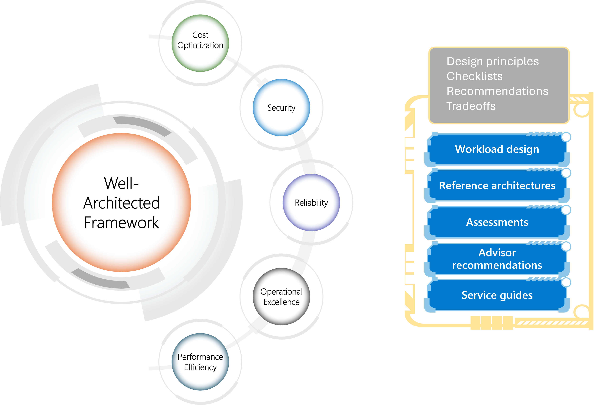

# The Well-Architected Architect

## Chris Ayers

---

## Chris Ayers

_Senior Site Reliability Engineer_
_Azure CXP AzRel_
_Microsoft_

<i class="fa-brands fa-bluesky"></i> BlueSky: [@chris-ayers.com](https://bsky.app/profile/chris-ayers.com)  
<i class="fa-brands fa-linkedin"></i> LinkedIn: - [chris\-l\-ayers](https://linkedin.com/in/chris-l-ayers/)  
<i class="fa fa-window-maximize"></i> Blog: [https://chris-ayers\.com/](https://chris-ayers.com/)  
<i class="fa-brands fa-github"></i> GitHub: [Codebytes](https://github.com/codebytes)  
<i class="fa-brands fa-mastodon"></i> Mastodon: [@Chrisayers@hachyderm.io](https://hachyderm.io/@Chrisayers)
~~<i class="fa-brands fa-twitter"></i> Twitter: [@Chris_L_Ayers](https://twitter.com/Chris_L_Ayers)~~  

---

# Agenda

- Solution Architecture Fundamentals
- Microsoft Azure Well-Architected Framework
- Pillar Deep Dive
- Trade-Offs
- WAF Service Guides & Impact
- Well-Architected Workloads
- Q&A

---

# Solution Architecture Fundamentals

- Decision-making framework  
- Cloud design patterns  
- Forward-thinking design  
- Design for supportability  
- Continuous skill enhancement  
- Collaboration for success  
- Methodical design approach

---

# Have a Decision-Making Framework

- **Identify & Log Decisions:** List expected choices early  
- **Make Informed Decisions:** Consider tradeoffs, risk, effort, and reversibility  
- **Document with ADRs:** Record the rationale behind each choice  
- **Follow Up:** Implement, communicate, and learn from outcomes

---

# Know Cloud Design Patterns

- Recognize both functional and nonfunctional requirements  
- Map design challenges to standardized cloud patterns  
- Leverage proven patterns for reliability, security, cost, and performance

---

# Be Forward-Thinking

- **Plan for Change:** Anticipate workload evolution and future needs  
- **Growth & Compliance:** Factor in scaling, regional expansion, and compliance changes  
- **Risk Analysis:** Evaluate preview features and avoid design cliffs  
- **Future-Proof:** Design with flexibility for long-term success

---

# Design for Supportability

- **Cloud Provider Support:** Ensure configurations align with provider best practices  
- **Operational Visibility:** Build in monitoring and clear insights for operations teams  
- **Customer Support:** Design to facilitate efficient customer issue resolution

---

# Maintain and Enhance Your Skills

- **Education:** Pursue training and certifications  
- **Community:** Engage with architecture communities and forums  
- **Exploration:** Participate in hackathons and exploratory exercises

---

# Collaborate for Success

- Leverage vendor expertise and consultative sessions  
- Engage with cloud solution architects for design reviews  
- Use external feedback to refine and optimize your architecture

---

# Be Methodical in Your Design Approach

- **Use Frameworks:** Combine WAF, TOGAF, and personal techniques (e.g., mind mapping)  
- **Structured Process:** Follow checklists, assessments, and reference materials  
- **Clear Communication:** Emphasize intentional decision-making and transparency

---

# Microsoft Azure Well-Architected Framework

---

# Microsoft Azure Well-Architected Framework Goals

The Azure Well-Architected Framework drives real world business outcomes by guiding organizations to:

- **Enhance Resilience:** Higher availability and faster recovery  
- **Improve Security:** Proactive protection of critical data  
- **Optimize Costs:** Streamlined resource usage  
- **Accelerate Innovation:** Faster feature deployment  
- **Boost Operational Excellence:** Robust monitoring and automation

---

# Business Impact & Real-World Examples

- **Enhanced Resilience:** Reduced downtime by up to 40% for a global retailer  
- **Cost Savings:** Lowered operational costs by 25% for a financial firm  
- **Operational Agility:** Faster deployments and improved customer satisfaction

_Framework adoption transforms technical improvements into measurable business impacts._

---

# Framework Benefits

- Resilient, available, and recoverable workloads  
- Strong security and risk management  
- Optimized costs with high ROI  
- Support for agile development and operations  
- Consistent performance and scalability

---

# The Five Pillars

| **Reliability**                    | **Security**                      | **Cost Optimization**             | **Operational Excellence**           | **Performance Efficiency**           |
|------------------------------------|-----------------------------------|-----------------------------------|--------------------------------------|--------------------------------------|
| Resiliency, availability, recovery | Data protection, threat detection | Budgeting, waste reduction        | Observability, DevOps, safe deployments | Scalability, load testing, monitoring |

---

## Pillar Design Principles: Reliability

A reliable workload must survive outages and malfunctions while continuing to consistently provide its intended functionality.

- **Business Requirements:** Requirements must cover user experience, data, workflows, and characteristics that are unique to the workload.
- **Resilience:** Operate with full or reduced functionality
- **Recovery:** Recover with minimal disruption
- **Operations:** Anticipate failure conditions
- **Simplicity:** Avoid overengineering

---

## Pillar Deep Dive: Reliability

**Common Scenarios:**

- Systems remain available during regional or service-specific failures
- Applications withstand unexpected traffic spikes without degradation

**Common Challenges:**

- Managing failover across multiple regions and environments

**Best Practices:**

- Design for multi-region redundancy and automated failover
- Regularly test disaster recovery and resiliency procedures
- Implement robust monitoring and alerting systems

---

## Pillar Design Principles: Security

- **Plan Security Readiness:** Establish a proactive security posture
- **Protect Critical Assets:** Ensure confidentiality, integrity, and availability
- **Evolve Continuously:** Stay ahead of emerging threats

---

## Pillar Deep Dive: Security

**Common Scenarios:**

- Safeguarding sensitive customer and financial data
- Meeting strict regulatory and compliance requirements

**Common Challenges:**

- Keeping pace with evolving cyber threats

**Best Practices:**

- Adopt a layered security strategy (defense in depth)
- Conduct regular vulnerability assessments and audits
- Use automated tools for continuous monitoring and incident response

---

## Pillar Design Principles: Cost Optimization

- **Discipline:** Develop robust cost-management practices
- **Mindset:** Focus on efficiency in resource usage
- **Monitoring:** Continuously analyze and optimize spending

---

## Pillar Deep Dive: Cost Optimization

**Common Scenarios:**

- Dynamically scaling resources during peak usage
- Optimizing workloads to minimize overprovisioning

**Common Challenges:**

- Correlating costs with performance metrics

**Best Practices:**

- Utilize cost management and monitoring tools
- Implement auto-scaling and right-sizing strategies
- Regularly review and adjust cost strategies based on data

---

## Pillar Design Principles: Operational Excellence

- **Embrace DevOps:** Foster a culture of continuous improvement
- **Enhance Observability:** Implement robust monitoring practices
- **Deploy Confidently:** Streamline deployment processes
- **Automate:** Increase efficiency through process automation

---

## Pillar Deep Dive: Operational Excellence

**Detailed Scenarios:**

- Coordinating deployments across multiple teams

**Common Challenges:**

- Bridging the gap between teams
- Ensuring consistent performance during rapid release cycles

**Best Practices:**

- Embrace CI/CD practices
- Establish clear operating procedures and incident response plans
- Leverage observability tools for real-time monitoring

---

## Pillar Design Principles: Performance Efficiency

- **Set Realistic Targets:** Establish achievable performance goals
- **Meet Capacity Needs:** Ensure sufficient resources are available
- **Optimize Continuously:** Enhance efficiency through ongoing improvements

---

## Pillar Deep Dive: Performance Efficiency

**Detailed Scenarios:**

- Delivering high performance under variable loads
- Optimizing application speed and responsiveness

**Common Challenges:**

- Balancing speed with resource constraints

**Best Practices:**

- Conduct regular load testing and benchmarking
- Utilize caching, CDNs, and optimized code practices
- Implement auto-scaling to adjust dynamically to demand

---

# Trade-Offs

---

# Trade-Offs in Applying the Framework

- Align trade-offs with business priorities
- Use scenario planning to assess impacts
- Continuously iterate and monitor performance

---

---

# Trade-Off: Reliability vs. Cost Optimization

## Prioritizing Reliability

- Invest in multi-region redundancy and automated failover  
- Deploy backup systems and advanced monitoring  
- Design for maximum uptime and minimal recovery time

## Prioritizing Cost Optimization

- Streamline deployments to reduce redundant resources  
- Select lower-cost regions or single-zone configurations  
- Accept moderate recovery times to keep expenses in check

<!-- **Detailed Example:**  
A multinational retailer chooses multi-region deployments with real-time failover to ensure business continuity during outages (prioritizing reliability). In contrast, a startup deploys in a single region with minimal redundancy to optimize costs while accepting potential downtime during failures. -->

---

# Trade-Off: Security vs. Performance Efficiency

## Prioritizing Security

- Implement multi-layered authentication and encryption  
- Conduct frequent vulnerability assessments and audits  
- Enforce strict access controls and compliance measures

## Prioritizing Performance Efficiency

- Use streamlined security protocols to minimize latency  
- Optimize application throughput with lightweight security measures  
- Focus on high-speed data processing and minimal overhead

<!-- **Detailed Example:**  
A financial institution employs robust encryption, multi-factor authentication, and continuous security monitoring to protect sensitive data (prioritizing security). Meanwhile, an online gaming platform opts for streamlined security measures to maximize responsiveness and reduce latency, even if that means a slightly reduced security posture. -->

---

# Trade-Off: Operational Excellence vs. Cost Optimization

## Prioritizing Operational Excellence

- Invest in comprehensive monitoring and automated incident response  
- Establish robust CI/CD pipelines and detailed SOPs  
- Enable proactive maintenance with real-time observability

## Prioritizing Cost Optimization

- Limit investments in advanced tooling and automation  
- Rely on manual processes and simplified monitoring setups  
- Focus on essential operations to minimize overhead

<!-- **Detailed Example:**  
An enterprise-level e-commerce platform invests in extensive monitoring tools, automated deployments, and 24/7 operations teams to ensure smooth operations (prioritizing operational excellence). In contrast, a small business adopts a lean approach with basic monitoring and manual incident management to reduce costs. -->

---

# Trade-Off: Performance Efficiency vs. Reliability

## Prioritizing Performance Efficiency

- Optimize architectures for speed and low latency  
- Use streamlined, lean deployments to maximize throughput  
- Emphasize rapid scaling and agile resource allocation

## Prioritizing Reliability

- Introduce redundancy and failover mechanisms  
- Focus on backup systems and error recovery procedures  
- Accept slight performance overhead to ensure continuous uptime

<!-- **Detailed Example:**  
A high-traffic content delivery network (CDN) is optimized for rapid data delivery and low latency (prioritizing performance efficiency). Conversely, a critical healthcare application incorporates redundant servers and rigorous failover systems to ensure constant availability, even if that adds a small performance cost. -->

---

# Trade-Off: Security vs. Operational Excellence

## Prioritizing Security

- Enforce strict controls, regular audits, and comprehensive risk management  
- Implement detailed logging and multi-layer defense strategies  
- Prioritize compliance and data protection over rapid changes

## Prioritizing Operational Excellence

- Focus on agile development and rapid deployment cycles  
- Invest in automation and streamlined processes for quick iterations  
- Emphasize continuous integration/deployment and proactive monitoring

<!-- **Detailed Example:**  
A government agency prioritizes extensive security measures—such as continuous audits and controlled access—to meet regulatory demands (prioritizing security), which can slow operational agility. In contrast, an innovative tech startup adopts rapid deployment and agile processes (prioritizing operational excellence), accepting a leaner security approach for faster market responses. -->

---

# Trade-Off: Performance Efficiency vs. Operational Excellence

## Prioritizing Performance Efficiency

- Optimize for minimal latency and high throughput  
- Use streamlined processes and lightweight monitoring tools  
- Emphasize rapid scaling and agile resource allocation

## Prioritizing Operational Excellence

- Invest in comprehensive monitoring and structured processes  
- Implement robust CI/CD pipelines and proactive incident management  
- Prioritize consistent performance and reliability through rigorous standards

<!-- **Detailed Example:**  
An e-commerce platform deploys lightweight, real-time analytics to maximize speed during flash sales (prioritizing performance efficiency). In contrast, a financial trading system adopts in-depth monitoring and structured operational protocols to ensure consistent uptime and compliance (prioritizing operational excellence). -->

---

# Trade-Off: Cost Optimization vs. Security

## Prioritizing Cost Optimization

- Choose cost-effective infrastructure with minimal redundancy  
- Limit investments in advanced security tools  
- Accept calculated security risks to maintain lower operational expenses

## Prioritizing Security

- Implement state-of-the-art encryption, multi-factor authentication, and continuous audits  
- Invest in advanced security infrastructure and dedicated monitoring teams  
- Prioritize risk mitigation over cost savings, even if expenses rise

<!-- **Detailed Example:**  
A startup deploys in a single, cost-effective region with basic security measures to minimize expenses (prioritizing cost optimization). Conversely, a government agency invests in robust threat detection and redundant systems to ensure top-tier protection despite higher costs (prioritizing security). -->

---

# Well-Architected Framework Service Guides

A Decision-Making Tool

- Assist in selecting Azure components for your workload  
- Highlight core features and capabilities essential for excellence  
- Not exhaustive configuration guides; emphasize what aligns with Well-Architected pillars  
- Enable informed decisions that support a state of operational excellence

---

# Well-Architected Workloads

- Align workloads with business outcomes using the Azure Well-Architected Framework  
- Balancing functional requirements and nonfunctional trade-offs  
- Integrate design fundamentals, trade-offs, and operational best practices

---

# Well-Architected Workloads Examples

- AI
- Azure Virtual Desktop  
- Azure VMware Solution  
- Mission-critical applications  
- Oracle
- SaaS Solutions
- SAP

---

# Well-Architected Framework Demo

---

# Q&A

---

## Resources

- [Well-Architected Framework](https://learn.microsoft.com/en-us/azure/well-architected/)
- [Microsoft Learn: Build great solutions with the Microsoft Azure Well-Architected Framework](https://learn.microsoft.com/en-us/training/paths/azure-well-architected-framework/)
- [Azure Advisor](https://learn.microsoft.com/en-us/azure/advisor/advisor-overview)  
- [Azure Architecture Center](https://learn.microsoft.com/en-us/azure/architecture/browse/)

## Chris Ayers

_Senior Site Reliability Engineer_
_Azure CXP AzRel_
_Microsoft_

<i class="fa-brands fa-bluesky"></i> BlueSky: [@chris-ayers.com](https://bsky.app/profile/chris-ayers.com)  
<i class="fa-brands fa-linkedin"></i> LinkedIn: - [chris\-l\-ayers](https://linkedin.com/in/chris-l-ayers/)  
<i class="fa fa-window-maximize"></i> Blog: [https://chris-ayers\.com/](https://chris-ayers.com/)  
<i class="fa-brands fa-github"></i> GitHub: [Codebytes](https://github.com/codebytes)  
<i class="fa-brands fa-mastodon"></i> Mastodon: [@Chrisayers@hachyderm.io](https://hachyderm.io/@Chrisayers)
~~<i class="fa-brands fa-twitter"></i> Twitter: [@Chris_L_Ayers](https://twitter.com/Chris_L_Ayers)~~  

<!-- Needed for mermaid -->

