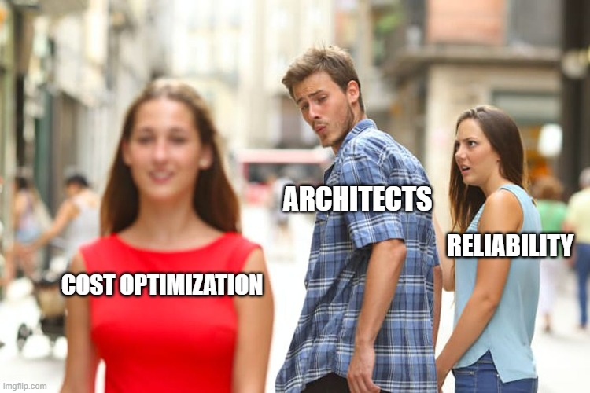

# The Well-Architected Architect

## Chris Ayers

---

## Chris Ayers

### Senior Site Reliability Engineer Azure CXP AzRel Microsoft

<i class="fa-brands fa-bluesky"></i> BlueSky: [@chris-ayers.com](https://bsky.app/profile/chris-ayers.com)  
<i class="fa-brands fa-linkedin"></i> LinkedIn: - [chris\-l\-ayers](https://linkedin.com/in/chris-l-ayers/)  
<i class="fa fa-window-maximize"></i> Blog: [https://chris-ayers\.com/](https://chris-ayers.com/)  
<i class="fa-brands fa-github"></i> GitHub: [Codebytes](https://github.com/codebytes)  
<i class="fa-brands fa-mastodon"></i> Mastodon: @Chrisayers@hachyderm.io  
~~<i class="fa-brands fa-twitter"></i> Twitter: @Chris_L_Ayers~~  

---

# Agenda

- Architecture
- Azure Well-Architected Framework
- Pillar Deep Dive
- Trade-offs
- WAF Service Guides Overview
- Tools
- Q&A

---

# Microsoft Azure Well-Architected Framework

The Azure Well-Architected Framework drives tangible business outcomes by guiding organizations to:

- **Enhance Resilience:** Achieve higher availability and faster recovery during outages  
- **Improve Security:** Protect critical data with proactive, risk-managed approaches  
- **Optimize Costs:** Streamline resource usage to reduce waste and lower expenses  
- **Accelerate Innovation:** Empower teams to deploy new features faster  
- **Boost Operational Excellence:** Ensure smooth operations through robust monitoring and automation

---

# Business Impact & Real-World Examples

## Driving Value Through the Framework

- **Enhanced Resilience**  
  *Case Study:* A multinational retail company reduced system downtime by 40% during peak periods

- **Cost Savings**  
  *Case Study:* A financial services firm cut operational costs by 25% while boosting performance

- **Operational Agility**  
  Organizations report faster deployments and improved customer satisfaction with secure, scalable solutions

*Takeaway:*  
Adopting the framework transforms technical improvements into measurable business benefits

---

# Framework Benefits

The Azure Well-Architected Framework helps workloads to:

- Remain resilient, available, and recoverable
- Achieve required levels of security
- Deliver a strong return on investment
- Support responsible development and operations
- Meet performance targets within acceptable timeframes

---

# The Five Pillars

## Microsoft Azure Well-Architected Framework Pillars

| **Reliability**                    | **Security**                      | **Cost Optimization**             | **Operational Excellence**           | **Performance Efficiency**           |
|------------------------------------|-----------------------------------|-----------------------------------|--------------------------------------|--------------------------------------|
| Resiliency, availability, recovery | Data protection, threat detection | Budgeting, waste reduction, efficiency | Observability, DevOps, safe deployments | Scalability, load testing, performance monitoring |

---

# Reliability Design Principles

- **Business Requirements:** Focus on the workload's intended utility  
- **Resilience:** Operate with full or reduced functionality  
- **Recovery:** Recover with minimal disruption  
- **Operations:** Anticipate failure conditions  
- **Simplicity:** Avoid overengineering  

---

# Reliability Deep Dive

**Detailed Scenarios:**

- Systems remain available during regional or service-specific failures  
- Applications withstand unexpected traffic spikes without degradation  

**Common Challenges:**

- Balancing redundancy with cost efficiency  
- Managing failover across multiple regions and environments  

**Best Practices:**

- Design for multi-region redundancy and automated failover  
- Regularly test disaster recovery and resiliency procedures  
- Implement robust monitoring and alerting systems  

---

# Security Design Principles

- **Plan Security Readiness:** Establish a proactive security posture  
- **Protect Critical Assets:** Ensure confidentiality, integrity, and availability  
- **Evolve Continuously:** Stay ahead of emerging threats  

---

# Security Deep Dive

**Detailed Scenarios:**

- Safeguarding sensitive customer and financial data  
- Meeting strict regulatory and compliance requirements  

**Common Challenges:**

- Keeping pace with evolving cyber threats  
- Managing complex identity and access control  

**Best Practices:**

- Adopt a layered security strategy (defense in depth)  
- Conduct regular vulnerability assessments and audits  
- Use automated tools for continuous monitoring and incident response  

---

# Cost Optimization Design Principles

- **Discipline:** Develop robust cost-management practices  
- **Mindset:** Focus on efficiency in resource usage  
- **Monitoring:** Continuously analyze and optimize spending  

---

# Cost Optimization Deep Dive

**Detailed Scenarios:**

- Dynamically scaling resources during peak usage  
- Optimizing workloads to minimize overprovisioning  

**Common Challenges:**

- Unpredictable usage patterns  
- Correlating costs with performance metrics  

**Best Practices:**

- Utilize cost management and monitoring tools  
- Implement auto-scaling and right-sizing strategies  
- Regularly review and adjust cost strategies based on data  

---

# Operational Excellence Design Principles

- **Embrace DevOps:** Foster a culture of continuous improvement  
- **Enhance Observability:** Implement robust monitoring practices  
- **Deploy Confidently:** Streamline deployment processes  
- **Automate:** Increase efficiency through process automation  

---

# Operational Excellence Deep Dive

**Detailed Scenarios:**

- Coordinating deployments across multiple teams  
- Maintaining high availability in complex environments  

**Common Challenges:**

- Bridging the gap between development and operations  
- Ensuring consistent performance during rapid release cycles  

**Best Practices:**

- Embrace CI/CD practices  
- Establish clear operating procedures and incident response plans  
- Leverage observability tools for real-time monitoring  

---

# Performance Efficiency Design Principles

- **Set Realistic Targets:** Establish achievable performance goals  
- **Meet Capacity Needs:** Ensure sufficient resources are available  
- **Optimize Continuously:** Enhance efficiency through ongoing improvements  

---

# Performance Efficiency Deep Dive

**Detailed Scenarios:**

- Delivering high performance under variable loads  
- Optimizing application speed and responsiveness  

**Common Challenges:**

- Balancing speed with resource constraints  
- Adapting to changing performance demands  

**Best Practices:**

- Conduct regular load testing and benchmarking  
- Utilize caching, CDNs, and optimized code practices  
- Implement auto-scaling to adjust dynamically to demand  

---

# Trade-Offs in Applying the Framework

**Balancing Considerations:**

- **Cost vs. Performance**  
- **Security vs. Usability**  
- **Operational Complexity vs. Agility**  
- **Resilience vs. Efficiency**

**Key Considerations:**

- Align with business priorities  
- Use scenario planning to assess impacts  
- Continuously iterate and monitor  

---

---

# Trade-Off: Reliability vs. Cost Optimization

**Reliability Priorities**  
- Multi-region redundancy, advanced failover  
- Higher uptime, minimal recovery time  

**Cost Optimization Priorities**  
- Single-region or fewer redundancies  
- Lower costs but potential downtime  

**Example:** A large retailer invests in multi-region failover for continuous operations, while a startup accepts potential downtime to save costs.

---

# Trade-Off: Security vs. Performance Efficiency

**Security Priorities**  
- Encrypted data, strict access controls  
- Higher overhead, possible latency impact  

**Performance Priorities**  
- Streamlined security for minimal overhead  
- Quick data processing, fast response times  

**Example:** A bank enforces robust encryption and monitoring, while an online game platform opts for lightweight security to reduce lag.

---

# Trade-Off: Operational Excellence vs. Cost Optimization

**Operational Excellence Priorities**  
- Comprehensive monitoring, automated responses  
- Higher operational overhead but smoother operations  

**Cost Optimization Priorities**  
- Limited tooling, manual processes  
- Lower costs but increased operational risk  

**Example:** An enterprise invests in advanced observability and 24/7 ops teams, while a small business relies on basic monitoring to minimize costs.

---

# Trade-Off: Performance Efficiency vs. Reliability

**Performance Priorities**  
- Lean architecture, minimal latency  
- Less redundancy for maximum throughput  

**Reliability Priorities**  
- Redundant systems, automated failover  
- Potential performance overhead for resilience  

**Example:** A CDN focuses on speed at scale, while a healthcare app invests in redundancy for guaranteed availability.

---

# Trade-Off: Security vs. Operational Excellence

**Security Priorities**  
- Strict compliance, frequent audits  
- Slower change cycles, more procedural overhead  

**Operational Excellence Priorities**  
- Rapid deployment, agile processes  
- Leaner security posture for faster iterations  

**Example:** A government agency enforces tight security and slow release cycles, whereas a startup prioritizes quick releases and minimal overhead.

---

# Trade-Off: Performance Efficiency vs. Operational Excellence

**Performance Priorities**  
- Lightweight monitoring, minimal overhead  
- Faster scaling, agile resource allocation  

**Operational Excellence Priorities**  
- In-depth monitoring, structured processes  
- Stable performance but more overhead  

**Example:** An e-commerce site uses real-time analytics with minimal overhead for flash sales, while a financial system relies on comprehensive monitoring for consistent uptime.

---

# Trade-Off: Cost Optimization vs. Security

**Cost Optimization Priorities**  
- Budget-friendly solutions, limited security tooling  
- Higher risk acceptance  

**Security Priorities**  
- Advanced threat detection, continuous auditing  
- Higher expense but reduced risk  

**Example:** A startup uses basic security to reduce costs, while a government agency invests heavily in threat detection and compliance.

---

# Well-Architected Framework Demo

---

# Well-Architected Workloads

---

## What are Well-Architected Workloads?

- Prioritizes key requirements to achieve specific goals.  
- Evaluated based on meeting its intended purpose.  
- Designed to be adaptable, secure, and deliver value.

---

# Examples of Well-Architected Workloads

- Azure Virtual Desktop  
- Azure VMware Solution  
- Mission-critical workloads  
- IoT, SAP, Oracle on IaaS  

---

# Service Guides

- Assist in decision-making for Azure components within workloads.  
- Highlight core features through the lens of WAF pillars.  

---

# WAF Service Guide Impact

- **Quick Decision-Making Tools**  
- **Informed Decisions**  
- **Expert Insights**  
- **Influential Guidance**

---

# WAF Assessment

- **Assessments**  
- **Recommendations**  
- **Actionable Insights**  
- **Optimization Strategies**

---

# Q&A

---

# Resources

## Links

- [Well-Architected Framework](https://learn.microsoft.com/en-us/azure/well-architected/)  
- [Well-Architected Workloads](https://learn.microsoft.com/en-us/azure/well-architected/workloads)  
- [WAF Service Guides](https://learn.microsoft.com/en-us/azure/well-architected/service-guides/?product=popular)  
- [Azure Advisor](https://learn.microsoft.com/en-us/azure/advisor/advisor-overview)  
- [Azure Architecture Center](https://learn.microsoft.com/en-us/azure/architecture/browse/)

## Follow Chris Ayers

<i class="fa-brands fa-bluesky"></i> BlueSky: [@chris-ayers.com](https://bsky.app/profile/chris-ayers.com)  
<i class="fa-brands fa-linkedin"></i> LinkedIn: - [chris\-l\-ayers](https://linkedin.com/in/chris-l-ayers/)  
<i class="fa fa-window-maximize"></i> Blog: [https://chris-ayers\.com/](https://chris-ayers.com/)  
<i class="fa-brands fa-github"></i> GitHub: [Codebytes](https://github.com/codebytes)  
<i class="fa-brands fa-mastodon"></i> Mastodon: @Chrisayers@hachyderm.io  
~~<i class="fa-brands fa-twitter"></i> Twitter: @Chris_L_Ayers~~  

<!-- Needed for mermaid, can be anywhere in file except frontmatter -->

