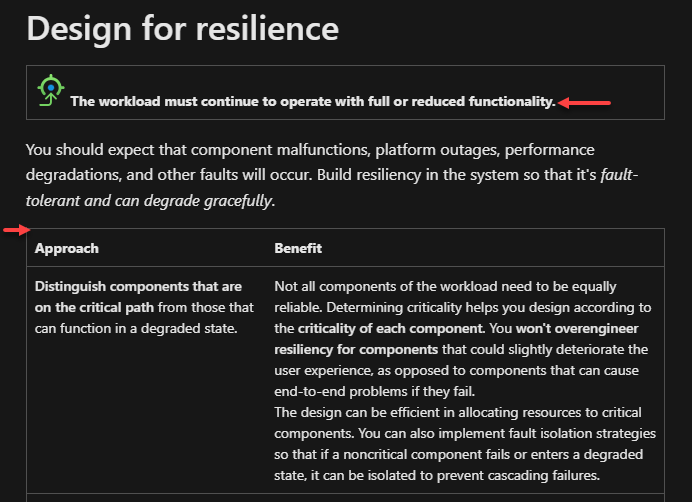
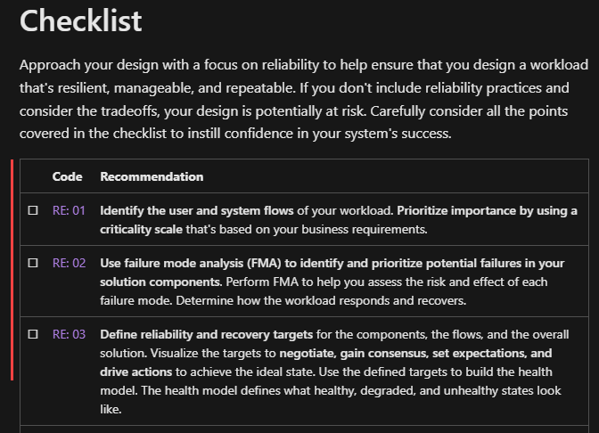
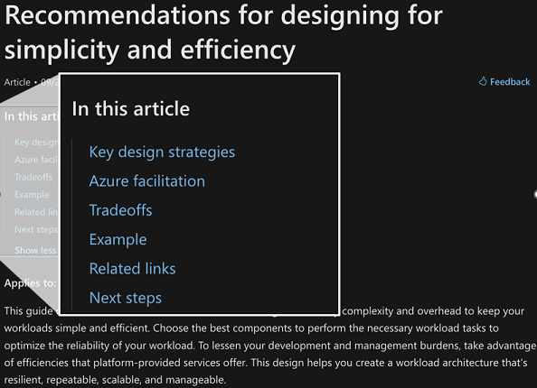

# The Well-Architected Architect
## Chris Ayers

---

## Chris Ayers

### Senior Risk SRE Azure CXP AzRel Microsoft

<i class="fa-brands fa-bluesky"></i> BlueSky: [@chris-ayers.com](https://bsky.app/profile/chris-ayers.com)
<i class="fa-brands fa-linkedin"></i> LinkedIn: - [chris\-l\-ayers](https://linkedin.com/in/chris-l-ayers/)
<i class="fa fa-window-maximize"></i> Blog: [https://chris-ayers\.com/](https://chris-ayers.com/)
<i class="fa-brands fa-github"></i> GitHub: [Codebytes](https://github.com/codebytes)
<i class="fa-brands fa-mastodon"></i> Mastodon: @Chrisayers@hachyderm.io
~~<i class="fa-brands fa-twitter"></i> Twitter: @Chris_L_Ayers~~

---

# Agenda

- Azure Well-Architected Framework
- Pillar Deep Dive
- Trade-offs
- WAF Service Guides Overview
- Tools
- Q&A

---

# Microsoft Azure Well-Architected Framework

---

# The Azure Well-Architected Framework

The Azure Well-Architected Framework is a design framework that can improve the quality of a workload by helping it to:

- Be resilient, available, and recoverable.
- Be as secure as you need it to be.
- Deliver a sufficient return on investment.
- Support responsible development and operations.
- Accomplish its purpose within acceptable timeframes.

---

## Microsoft Azure Well-Architected Framework Pillars

| Reliability                        | Security                            | Cost Optimization                  | Operational Excellence                  | Performance Efficiency                  |
|------------------------------------|-------------------------------------|------------------------------------|-----------------------------------------|-----------------------------------------|
| Resiliency, availability, recovery | Protect data, detect threats, mitigate risks | Budgeting, reducing waste, efficiency | Observability, DevOps practices, safe deployments | Scalability, load testing, performance monitoring |

---

# Design Principles

Each pillar provides recommended practices, risk considerations, and tradeoffs. Design decisions must balance across all pillars, given the business requirements.

---

# Checklists

Start with the checklist for each pillar to evaluate your design choices. Each item on the checklist is accompanied by recommendation guides that describe key strategies and how Azure helps you attain the recommendation.

---

# Recommendation Guides

Recommendation guides offer detailed strategies for achieving the goals of each pillar. They provide actionable guidance and best practices to ensure your workload meets the desired standards.

---

# Cloud Design Patterns

Cloud design patterns are mapped to the pillars they directly support. These patterns help you implement reliable, secure, cost-effective, operationally excellent, and performant solutions.

---

# Tradeoffs and Risks

Each architectural decision involves tradeoffs and risks. The framework highlights these considerations to help you make informed decisions that balance the various aspects of the framework.

---

# Audience

The framework applies to teams responsible for improving workloads and addressing cross-cutting concerns. It provides valuable insights for architects, developers, operators, and business stakeholders.

---

# Goals

The primary objective is to set you up for success when deploying workloads on Azure. It helps you understand tradeoffs, optimize over time, and ensure successful implementation.

---

# The Five Pillars

---

# Reliability Overview

Outages and malfunctions are critical concerns. A reliable workload must survive these events, maintaining functionality and availability. It should detect, withstand, and recover from failures within an acceptable time, ensuring users can access it as promised.

---

# Reliability Design Principles

- Focus on the workload's intended utility.
- Operate with full or reduced functionality.
- Recover with minimal disruption.
- Anticipate failure conditions.
- Avoid overengineering.

---

# Security Overview

Adopt a zero-trust approach to ensure resilience by incorporating the CIA triad. Use the Microsoft Zero Trust model to verify identities, apply least-privilege access, and assume breaches. Continuously improve security measures to stay ahead of threats. Balance security with reliability to enhance effectiveness and build user trust.

---

# Security Design Principles

- Plan your security readiness.
- Protect confidentiality, integrity, and availability.
- Evolve security posture to stay ahead of attackers.

---
# Cost Optimization Overview

Design architecture with business goals, ROI, and financial constraints in mind. Consider budget alignment, spending patterns, and resource utilization. A cost-optimized workload balances cost with security, scalability, resilience, and operability. Prioritize long-term strategies with continuous monitoring and repeatable processes to avoid risky, short-term cost reductions.

---

# Cost Optimization Design Principles

- Develop cost-management discipline.
- Maintain a cost-efficiency mindset.
- Monitor and optimize over time.

---

# Operational Excellence Overview

DevOps practices ensure workload quality through standardized workflows and team cohesion. Minimize process variance, human error, and customer disruption. Continuously evaluate and improve operations to meet business and compliance requirements. Aim for reliable and predictable workloads.

---

# Operational Excellence Design Principles

- Embrace DevOps culture.
- Evolve operations with observability.
- Deploy with confidence.
- Automate for efficiency.

---

# Performance Efficiency Overview

Performance efficiency ensures workloads meet user expectations. Optimize resource utilization, scalability, and responsiveness. Monitor performance metrics to identify bottlenecks and optimize resource allocation. Continuously improve performance to meet user needs and business goals.

---

# Performance Efficiency Design Principles

- Negotiate realistic performance targets.
- Meet capacity requirements.
- Improve efficiency through optimization.

---

# Well-Architected Framework Demo

---

# Well-Architected Workloads

---

## What are Well-Architected Workloads?

- Prioritizes key requirements to achieve specific goals.
- Evaluated based on meeting its intended purpose.
- Designed to be adaptable, secure, and deliver value.

---

# Examples of Well-Architected Workloads

- Azure Virtual Desktop
- Azure VMware Solution
- Mission-critical workloads
- IoT, SAP, Oracle on IaaS

---

# Service Guides

- Assist in decision-making for Azure components within workloads.
- Highlight core features through the lens of WAF pillars.

---

# WAF Service Guide Impact

- **Quick Decision-Making Tools**
- **Informed Decisions**
- **Expert Insights**
- **Influential Guidance**

---

# WAF Assessment

- **Assessments**
- **Recommendations**
- **Actionable Insights**
- **Optimization Strategies**

---

# Q&A

---

# Resources

## Links

- [Well-Architected Framework](https://learn.microsoft.com/en-us/azure/well-architected/)
- [Well-Architected Workloads](https://learn.microsoft.com/en-us/azure/well-architected/workloads)
- [WAF Service Guides](https://learn.microsoft.com/en-us/azure/well-architected/service-guides/?product=popular)
- [Azure Advisor](https://learn.microsoft.com/en-us/azure/advisor/advisor-overview)
- [Azure Architecture Center](https://learn.microsoft.com/en-us/azure/architecture/browse/)

## Follow Chris Ayers

<i class="fa-brands fa-bluesky"></i> BlueSky: [@chris-ayers.com](https://bsky.app/profile/chris-ayers.com)
<i class="fa-brands fa-linkedin"></i> LinkedIn: - [chris\-l\-ayers](https://linkedin.com/in/chris-l-ayers/)
<i class="fa fa-window-maximize"></i> Blog: [https://chris-ayers\.com/](https://chris-ayers.com/)
<i class="fa-brands fa-github"></i> GitHub: [Codebytes](https://github.com/codebytes)
<i class="fa-brands fa-mastodon"></i> Mastodon: @Chrisayers@hachyderm.io
~~<i class="fa-brands fa-twitter"></i> Twitter: @Chris_L_Ayers~~

<!-- Needed for mermaid, can be anywhere in file except frontmatter -->

