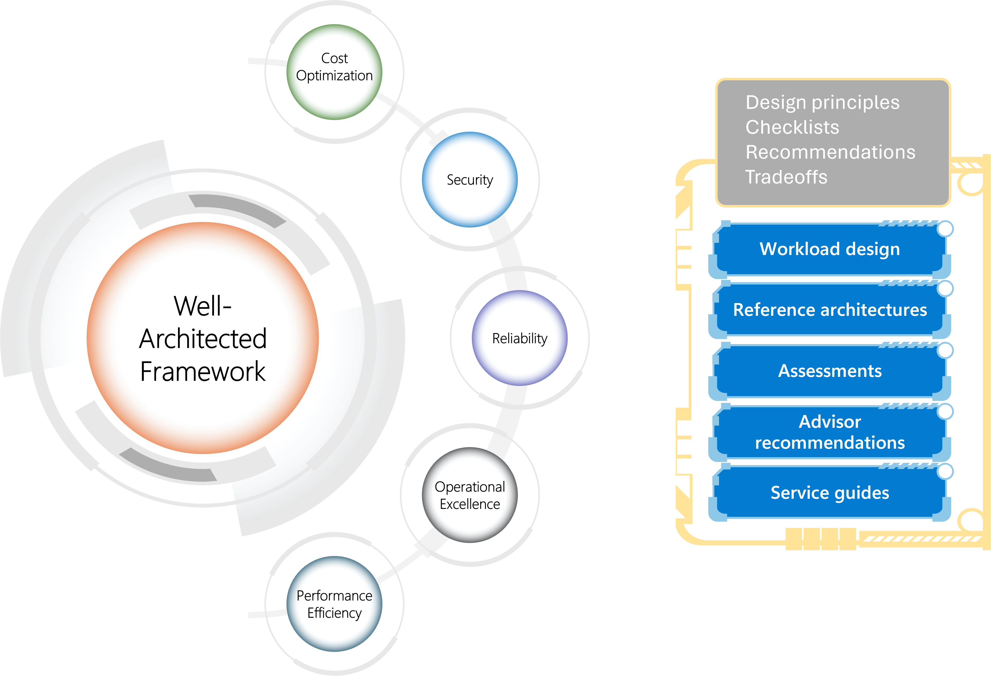
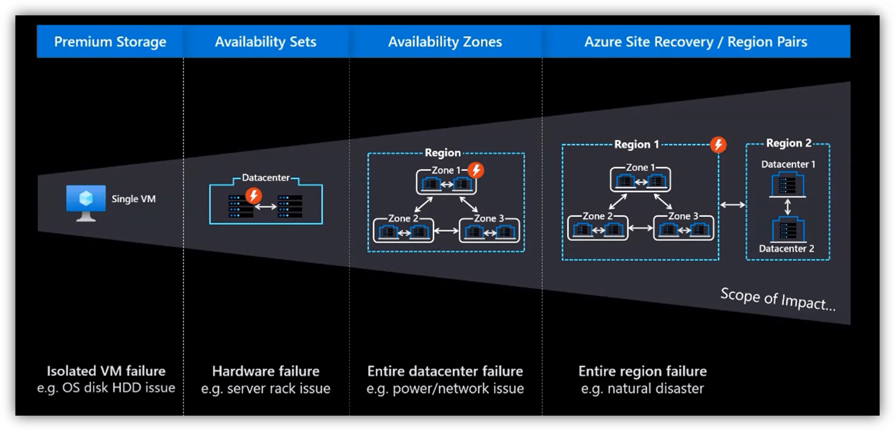

---

<!-- _color: white -->


<div class="columns">

<div>

# The Well-Architected Architect

## Modernizing Cloud Excellence

## Chris Ayers

</div>
<div>


</div>
</div>

---


## Chris Ayers

_Senior Software Engineer_
_Azure CXP AzRel_
_Microsoft_

<i class="fa-brands fa-bluesky"></i> BlueSky: [@chris-ayers.com](https://bsky.app/profile/chris-ayers.com)  
<i class="fa-brands fa-linkedin"></i> LinkedIn: - [chris\-l\-ayers](https://linkedin.com/in/chris-l-ayers/)  
<i class="fa fa-window-maximize"></i> Blog: [https://chris-ayers\.com/](https://chris-ayers.com/)  
<i class="fa-brands fa-github"></i> GitHub: [Codebytes](https://github.com/codebytes)  
<i class="fa-brands fa-mastodon"></i> Mastodon: [@Chrisayers@hachyderm.io](https://hachyderm.io/@Chrisayers)
~~<i class="fa-brands fa-twitter"></i> Twitter: [@Chris_L_Ayers](https://twitter.com/Chris_L_Ayers)~~  

---

# Agenda

- Solution Architecture Fundamentals
- Microsoft Azure Well-Architected Framework
- Framework Overview & Assessment Cadence
- Pillar Deep Dive
- Trade-Offs
- WAF Service Guides & Impact
- Well-Architected Workloads
- Q&A

---

# Solution Architecture Fundamentals

## 7 Principles for Cloud Excellence

<div class="columns">
<div>

### 🎯 Strategic

1. **Decision Framework**
2. **Design Patterns**
3. **Future Thinking**

> "Architecture is a team sport played with strategic thinking"

</div>
<div>

### 🛠️ Operational

4. **Supportability**
5. **Continuous Learning**

### 🤝 Collaborative

6. **Team Success**
7. **Methodical Approach**

</div>
</div>

---

# Architecture Fundamentals - Core Role Focus

Architecture = Intentional decision system.

**You Own:**

- Map requirements → patterns & platform
- Bake in ops (observability, support, DR) early
- Surface & record trade-offs fast
- Keep design iterative & reversible first

**Superpower:** Multi-perspective experience (build → run → secure → recover).

> Ongoing decisions, not a static diagram.

---

# Architecture Fundamentals - Decision Framework

5 Steps (loop): Identify → Analyze → Decide → Implement → Learn.

## Keys

- Track decisions in backlog early
- Classify reversible vs one-way doors
- Capture rationale & alternatives (ADR)
- Link ADR → work items
- Update after incidents / KPIs

> Bias to reversible choices under uncertainty.

---

# Architecture Fundamentals - Pattern & Forward Thinking

<div class="columns">
<div>

## Patterns

- Use proven patterns (circuit breaker, cache-aside, bulkhead, valet key)
- Prefer simplicity over bespoke cleverness

</div>
<div>

## Forward Scan

- Scale & data growth thresholds
- Compliance / residency horizon
- Deprecations & preview risk
- Evolution seams pre-planned

</div>
</div>

> Instrument to see approaching cliffs early.

---

# Architecture Fundamentals - Supportability & Collaboration

<div class="columns">
<div>

## Supportability

- Standard telemetry schema
- Golden signals + synthetics
- Correlation IDs & clear errors

</div>
<div>

## Collaboration

- Cross-discipline reviews
- External architecture consults
- Pattern & ADR library upkeep

</div>
</div>

**Growth Loop**: Learn → apply → codify.

> If not operable, it’s not done.

---

# Architecture Fundamentals - Method & Improvement

## Toolkit

- Checklists & maturity baseline
- ADR catalog + pattern library
- Fitness reports (drift & KPI deltas)

## Loop

Assess → Prioritize → Implement → Validate → Instrument → Reassess

Outcome: Intentional, current architecture.

---

# 1. Decision-Making Framework

<div class="columns">
<div>

### **Architecture Decision Records**

```markdown
# ADR-001: Multi-Region Strategy
Status: Accepted
Date: 2025-01-15

## Context
Need 99.99% availability for 
critical healthcare platform

## Decision
Implement active-active across
3 Azure regions

## Consequences
- 3x infrastructure cost
- Complex data sync
```

</div>
<div>

### **Key Elements**

✅ **Early Identification**
Document decisions before they're made

✅ **Risk Assessment**
One-way doors vs. two-way doors

✅ **Clear Rationale**
Why this choice over alternatives

✅ **Learning Loop**
Post-implementation reviews

</div>
</div>

---

# 2. Master Cloud Design Patterns

<div class="columns">
<div>

### **Reliability Patterns**

- 🔄 Circuit Breaker
- 🎯 Bulkhead Isolation
- ♻️ Retry with Backoff

### **Performance Patterns**

- 📦 Cache-Aside
- 🚀 CQRS
- 📊 Event Sourcing

</div>
<div>

### **Security Patterns**

- 🔐 Valet Key
- 🛡️ Gatekeeper
- 🎭 Federated Identity

### **Modern Patterns**

- 📡 Event-Driven
- 🔗 Service Mesh
- 🌐 Edge Computing

</div>
</div>

> 💡 **Pro Tip:** Start with [Azure Architecture Center](https://aka.ms/architecture) pattern catalog

---

# 3. Forward-Thinking Design

<div class="columns">
<div>

### 🔮 **Anticipate Change**

- Workload growth: 10x planning
- Regional expansion readiness
- Compliance evolution tracking

### 🚀 **Embrace Innovation**

- Preview features evaluation matrix
- Gradual rollout strategies
- Fallback mechanisms

</div>
<div>

### 🛡️ **Avoid Design Cliffs**

- No single points of failure
- Vendor lock-in mitigation
- Technology abstraction layers

**Real Example:** Netflix's migration from monolith → microservices → serverless

</div>
</div>

---

# 4. Design for Supportability

<div class="columns">
<div>

## 📊 **Observable by Default**

### Every service includes

- Structured logging
- Distributed tracing
- Custom metrics
- Health endpoints
- SLI/SLO dashboards

</div>
<div>

## 🔧 **Support-Friendly**

- Self-healing mechanisms
- Graceful degradation
- Clear error messages
- Runbook automation
- ChatOps integration

</div>
</div>

**Success Metric:** Time to resolve incidents ↓ 75% with proper observability

---

# 5. Continuous Skill Enhancement

<div class="columns">
<div>

### 📚 **Learning Paths**

- **Certifications:** AZ-305, AI-102
- **Specializations:** FinOps, MLOps
- **Emerging:** Quantum, Edge AI

### 🏗️ **Hands-On Practice**

- Weekly architecture katas
- Open source contributions
- Hackathon participation

</div>
<div>

### 🤖 **AI-Augmented Skills**

- Copilot for architecture
- AI-assisted code reviews
- Automated documentation
- Pattern recognition tools

### 🌐 **Community**

- Local meetups
- Architecture forums
- Conference speaking

</div>
</div>

---

# 6. Collaboration Excellence

## 🤝 **Key Partnerships**

<div class="columns">
<div>

### Internal Teams

- Product owners
- Security champions
- Site reliability engineers
- Data scientists

</div>
<div>

### External Experts

- Cloud solution architects
- Partner technical specialists
- Community MVPs
- Industry consultants

</div>
</div>

<!-- 
### 🎯 **Collaboration Artifacts**

- Architecture review boards
- Design thinking workshops
- Failure scenario planning
- Cost optimization sessions
-  -->

---

# 7. Methodical Design Approach

## Structure Brings Success

### 🛠️ **Essential Tools**

- **Design:** Visio, Draw.io, Lucidchart, C4 Model
- **Documentation:** ADRs, Wiki, Backstage
- **Assessment:** WAF Review, Azure Advisor
- **Validation:** Chaos Engineering, Load Testing

> "A good architecture is not accidental-it's methodical"

---

# Microsoft Azure Well-Architected Framework



---

# Microsoft Azure Well-Architected Framework Goals

The Azure Well-Architected Framework drives real world business outcomes by guiding organizations to:

- **Enhance Resilience:** Higher availability and faster recovery  
- **Improve Security:** Proactive protection of critical data  
- **Optimize Costs:** Streamlined resource usage  
- **Accelerate Innovation:** Faster feature deployment  
- **Boost Operational Excellence:** Robust monitoring and automation

---

# Business Impact: Real Numbers

## Proven ROI & Outcomes

- **304% ROI** within 3 years (Forrester Study)
- **40% reduction** in downtime (Global Retailer)
- **25% cost savings** (Financial Services)
- **75% faster** server updates (Manufacturing)
- **93/100** security score (Profisee)

<!-- Removed missing image: img/roi-chart.png (not found). Consider adding a local chart image or keep text KPIs only. -->

---

# Framework Benefits

- Resilient, available, and recoverable workloads  
- Strong security and risk management  
- Optimized costs with high ROI  
- Support for agile development and operations  
- Consistent performance and scalability

---

# Azure Well-Architected Framework Overview

<style scoped>
table { display: table; }
tr { display: table-row; }
td, th { display: table-cell; }
table {
  width: 100%;
}
</style>

| Pillar | Core Goal |
|--------|-----------|
| Reliability | Stay available & recover fast |
| Security | Protect identities, data & workloads |
| Cost Optimization | Maximize business value per dollar |
| Operational Excellence | Efficient operations & rapid improvement |
| Performance Efficiency | Right-size & scale on demand |

> Treat the framework as an ongoing fitness regimen-not a one-time audit.

---

# Reliability Pillar

> "Will it stay up & recover?"

Focus on sustained availability, graceful degradation, and validated recovery.

---

# Reliability - Principles

Reliability = keep user promise under failure.

- Explicit SLI/RTO/RPO & UX expectations
- Design for graceful degradation (resilience)
- Fast detect + recover (observability + runbooks)
- Minimize complexity in critical paths

> Maxim: Resilience is engineered, not discovered after the fact.

---

# Reliability - Practices

- Multi-region for Tier 0 + health probes
- Quarterly chaos experiments
- Synthetic user journeys + health model
- Tiered backups + timed restore drills
- Automated failover validation

Emerging:

- Advisor Score driven next action
- Shift to automated chaos

---

<style scoped>
table { display: table; }
tr { display: table-row; }
td, th { display: table-cell; }
table {
  width: 100%;
}
</style>

# Reliability - Key Metrics

| Metric | Target | Lever |
|--------|--------|-------|
| Request Success Rate | ≥ 99.9% (align to SLO) | Progressive delivery + health probes + fast rollback |
| Error Budget Burn | < 20% cycle | SLO review + hardening |
| MTTR | ↓ trend | Auto diagnostics + rollback |
| Restore Drill Success | ≥ 99% | Timed restore exercises |

Levers: failover tests, chaos, simplification.

---

# Reliability - Architecture Example



---

# Reliability - Maturity Progression

| Level | Current | Next Shift | Accelerator |
|-------|---------|-----------|------------|
| 1 Ad Hoc | Manual restarts; unknown backup validity | Define & test RTO/RPO | Scope + first timed restore |
| 2 Baseline | Documented failover path | Probes + scheduled restore drills | Drill cadence |
| 3 Structured | Runbooks + starter chaos | SLO + error budget govern releases | Chaos on critical flows |
| 4 Proactive | Auto failover + health model | Timed restore KPIs + broaden chaos | CI failover test |
| 5 Adaptive | Continuous resilience engineering | Predictive scale + self-heal loops | Predictive scaling + self-heal scripts |

> Sequence: remove unknowns → speed detection → widen safe automation.

<!-- Risks: L1 False recoverability; L2 Late backup corruption detection; L3 Hidden SPOF; L4 Design vs reality drift; L5 Slow novel failure detection. -->

---

### Reliability - At a Glance

<div class="columns">
<div>

**Core Azure Focus**  
🧭 Multi-region & AZ design  
🛡️ Data protection (backup + geo-replication)  
🩺 Health modeling & synthetic probes  

**Fast Diagnostic**  
`Last chaos / failover drill outcome` (✅ / ❌)

> Focus first on removing unknowns in recovery path before adding more redundancy.

</div>
<div>

**Typical Early Gap**  
🚩 Runbooks never fully executed end-to-end

**Signals to Track**  

- Error budget burn %  
- RTO / RPO adherence  
- Successful timed restore drills  

**Quick Win**  
Run a 30-min tabletop + one automated failover script this week.

</div>
</div>

---

# Security Pillar

> "Can it be breached or abused?"

Emphasizes least privilege, segmentation, and continuous threat detection.

---

# Security - Principles

- Threat model + shared responsibility upfront
- Least privilege + segmentation + encryption
- Continuous assessment & patch / vuln flow
- Zero Trust verification on every request

> Maxim: Security is an engineering practice, not a gate.

---

# Security - Practices & Patterns

- Enforce Zero Trust (MFA, CA, JIT)
- Secrets in Key Vault only
- Network segmentation + WAF
- Defender for Cloud remediation SLAs
- Central security logging

Emerging:

- AI workload safeguards (watermarking)
- Automated threat triage (Copilot)

---

# Security - Key Metrics

| Metric | Target | Lever |
|--------|--------|-------|
| Secure Score | > 80% | Prioritized remediation |
| MFA Coverage | 100% | Conditional Access policies |
| Vuln MTTR | < 14 days | Patch automation |

Levers: least privilege, segmentation, scanning.

---

# Security - Architecture Example

1. Front Door + WAF + DDoS
2. App Gateway / mTLS ingress
3. Segmented app tier (private endpoints)
4. Key Vault + encrypted data stores
5. Central SIEM + automated triage

> Blueprint Goal: Rapid containment & traceability.

---

# Security - Maturity Progression

| Level | Focus | Key Shift |
|-------|-------|-----------|
| 1 Core | Hygiene: MFA, patch, secrets externalized | Enforce MFA & baseline hardening |
| 2 Expanded | Segmentation & posture tracking | Secure Score driven backlog |
| 3 Threat-Informed | Threat modeling + IR playbooks | Centralized logging & triage |
| 4 Adaptive | Automated response & risk-based access | Workflow automation (SOAR) |
| 5 Advanced | Continuous simulation & ML detection | Zero Trust everywhere + least privilege by design |

> Move from static controls → signal-driven prevention & rapid containment.

---

# Security - Maturity Accelerators

| Level | Accelerator Focus | Typical Risk if Ignored |
|-------|-------------------|--------------------------|
| 1 | MFA everywhere + secret externalization | Credential stuffing / leaked keys |
| 2 | Segmentation + Secure Score backlog | Flat trust zones expand blast radius |
| 3 | Threat modeling + IR runbooks | Slow breach containment |
| 4 | SOAR automation + risk-based policies | Analyst fatigue / alert backlog |
| 5 | Continuous simulation (red/purple) | Control regressions undetected |

> Mature = shorten dwell time & shrink blast radius while reducing analyst toil.

---

### Security - At a Glance

<div class="columns">
<div>

**Core Azure Focus**  
🆔 Strong identity (MFA / Conditional Access)  
🔐 Secrets in Key Vault only  
🧱 Segmentation + threat detection (Defender / Sentinel)

**Fast Diagnostic**  
`Secure Score trend` + count of open critical vulns

</div>
<div>

**Typical Early Gap**  
🚩 Privileged identity hygiene (stale Global Admins)

**Signals to Track**  

- MFA coverage %  
- Key Vault secret rot cadence  
- Vulnerability MTTR  

**Quick Win**  
Expire unused privileged roles & enable PIM + just-in-time elevation.

</div>
</div>

> Treat identity as the primary security boundary; reduce standing privilege relentlessly.

---

# Cost Optimization Pillar

> "Are we creating value per dollar?"

Drives financial accountability, efficiency, and spend-to-value alignment.

---

# Cost Optimization - Principles

- Budget guardrails + ownership tagging
- Engineer elasticity & eliminate waste
- Tie spend to business KPIs & unit cost
- Document cost vs reliability/perf trade-offs

> Maxim: Unmeasured cost is uncontrolled cost.

---

# Cost Optimization - Practices & Governance

- Enforced tagging & budgets
- Autoscale + off-hour shutdown
- Rightsize & commitment coverage
- Spot / tiered storage
- Anomaly detection & review

Emerging:

- Sustainability KPIs (energy proxy)
- Caching to reduce expensive ops

---

# Cost Optimization - Key Metrics

| Metric | Target | Lever |
|--------|--------|-------|
| Idle Spend | < 5% | Decommission & schedules |
| Commitment Coverage | > 70% | Rightsize + purchase planning |
| Unit Cost | ↓ QoQ | Performance + elasticity |

Levers: tagging, scaling, lifecycle policies.

---

# Cost Optimization - Architecture Example

1. Enforced tagging & budgets
2. Autoscale + spot for batch
3. Storage tiering lifecycle
4. Cache hot read reduction
5. Cost dashboard & anomaly alerts

> Blueprint Goal: Predictable unit economics.

---

# Cost Optimization - Maturity Progression

| Level | Focus | Key Shift |
|-------|-------|-----------|
| 1 Ownership | Tags + basic visibility | Assign DRI & shared spend transparency |
| 2 Visibility | Cost model + budgets/alerts | Formalize reports & baseline drivers |
| 3 Signals | Usage & flow analysis | Guardrails + anomaly triage cadence |
| 4 Production Insights | Rightsizing & demand shaping | Autoscale tuning + lifecycle policies |
| 5 Optimize @ Scale | Predictive & unit economics | Forecast accuracy + DR cost optimization |

> Treat cost like a performance metric: observable, owned, iterated.

---

# Cost Optimization - Maturity Accelerators

| Level | Accelerator Focus | Typical Risk if Ignored |
|-------|-------------------|--------------------------|
| 1 | Tag policy + cost DRI | Unattributed spend growth |
| 2 | Cost model + budget alerts | Surprise overruns / reactive cuts |
| 3 | Anomaly triage cadence | Persistent waste in idle flows |
| 4 | Demand shaping + rightsizing loops | Scaling costs outpace revenue |
| 5 | Forecast accuracy + DR cost review | Overpaying for unused resilience |

> Aim for unit economics clarity before advanced forecasting automation.

---

### Cost Optimization - At a Glance

<div class="columns">
<div>

**Core Azure Focus**  
🏷️ Enforced tagging & ownership  
📉 Elasticity & rightsizing loops  
🗃️ Storage lifecycle + commitment mgmt

**Fast Diagnostic**  
`Idle spend %` + tag coverage heatmap

</div>
<div>

**Typical Early Gap**  
🚩 No policy-backed tagging = opaque spend

**Signals to Track**  

- Idle / unattached resources  
- Savings Plan / RI coverage %  
- Unit cost (e.g., $ / txn) trend  

**Quick Win**  
Implement a tag policy (env, owner, costCenter) + weekly idle resource report.

</div>
</div>

> Cost fitness = visibility → accountability → automation. Optimize after measuring.

---

# Operational Excellence Pillar

> "Can we change & learn fast?"

Centers on disciplined delivery, observability, and continual improvement.

---

# Operational Excellence - Principles

- Shared ownership (build → run)
- Instrument first; scale second
- Progressive, reversible deploys
- Automate high-frequency toil

> Maxim: Operate to learn; learn to operate better.

---

# Operational Excellence - Practices & Automation

- Gated CI/CD + policy
- Progressive delivery rings
- Standard SLO dashboards
- Automate frequent runbooks
- Blameless retros → ADR updates

Emerging:

- Maturity scoring focus
- AI-assisted event reduction

---

# Operational Excellence - Key Metrics

| Metric | Target | Lever |
|--------|--------|-------|
| Deploy Frequency | Daily+ | Small batches + automation |
| Change Failure Rate | < 15% | Progressive rollout + tests |
| MTTR | < 1h Sev2 | Runbooks + observability |

Levers: telemetry unification, rollback automation.

---

# Operational Excellence - Architecture Example

1. Gated PR → secure build
2. Canary + progressive rings
3. Unified telemetry spine
4. Automated remediation rules
5. Post-incident ADR updates

> Blueprint Goal: High velocity, low MTTR.

---

# Operational Excellence - Maturity Progression

| Level | Focus | Key Shift |
|-------|-------|-----------|
| 1 Foundation | DevOps culture + basic CI | Shared vocab & source control norms |
| 2 Standardize | Roles, IaC, core processes | Off-the-shelf tooling & baseline automation |
| 3 Release Ready | Environments + gated pipelines | Health model + incident workflow |
| 4 Production Ops | SLO dashboards + progressive delivery | Runbook automation & retros to ADRs |
| 5 Adaptable | Continuous modernization | Self-service envs & pervasive automation |

> Maturity = lower change friction while increasing safety.

---

# Operational Excellence - Maturity Accelerators

| Level | Accelerator Focus | Typical Risk if Ignored |
|-------|-------------------|--------------------------|
| 1 | Shared on-call + IaC adoption | Tribal ops knowledge silos |
| 2 | Standardized pipelines + roles | Inconsistent release quality |
| 3 | Health model + incident taxonomy | Alert noise & unclear severity |
| 4 | Auto-remediation + retro to ADR loop | Repeating incidents / slow MTTR gains |
| 5 | Self-service env + friction audits | Innovation slowdown / shadow ops |

> Reliability & velocity converge when feedback loops are automated and trusted.

---

### Operational Excellence - At a Glance

<div class="columns">
<div>

**Core Azure Focus**  
🚀 Gated CI/CD + progressive delivery  
📊 Unified observability spine  
🛠️ Automated runbooks & incident workflow

**Fast Diagnostic**  
`DORA metrics snapshot` (Deploy Freq, Lead Time, CFR, MTTR)

</div>
<div>

**Typical Early Gap**  
🚩 Telemetry exists but no actionable SLO dashboards

**Signals to Track**  

- Change failure rate (%)  
- MTTR trend  
- Auto-remediation success count  

**Quick Win**  
Define one SLO + error budget and wire alert to a Slack/Teams channel.

</div>
</div>

> Velocity safely increases when feedback loops are fast, visible, and trusted.

---

# Performance Efficiency Pillar

> "Will it meet SLOs under scale?"

Ensures responsive scaling, optimized hot paths, and sustained tail latency control.

---

# Performance Efficiency - Principles

- Business SLOs (latency / throughput)
- Just-in-time elastic scaling
- Partition & cache for hot paths
- Measure & tune based on profiling

> Maxim: Performance is a promise you must continuously verify.

---

# Performance Efficiency - Practices & Patterns

- Load + capacity tests pre-peak
- Autoscale on meaningful metrics
- CDN + Redis hot path caching
- Partition / shard early
- Profile tail latency (P95/P99)

Emerging:

- Adaptive concurrency controls
- Predictive autoscale policies

---

# Performance Efficiency - Key Metrics

| Metric | Target | Lever |
|--------|--------|-------|
| P95 Latency | SLO met | Caching + profiling |
| Cache Hit Ratio | > 85% | Key design + eviction |
| Autoscale Reaction | < 5 min | Threshold tuning |

Levers: async patterns, caching, partitioning.

---

# Performance Efficiency - Architecture Example

1. CDN + Front Door cache
2. Stateless autoscaling API
3. Async queue offload
4. Redis + partitioned data
5. Predictive scale rules

> Blueprint Goal: Linear scale within latency SLO.

---

# Performance Efficiency - Maturity Progression

| Level | Focus | Key Shift |
|-------|-------|-----------|
| 1 Targets | Initial SLOs & component fit | Capture perf expectations early |
| 2 Baseline Metrics | Instrument & capacity plan | Critical flow metrics & baselines |
| 3 Signal Driven | Real user + synthetic insights | Hot path tuning + data-driven refactors |
| 4 Prod Optimization | Isolation & advanced data mgmt | Perf gates in delivery pipeline |
| 5 Continuous Tuning | Experimentation & automation | Hypothesis-driven improvements & predictive scale |

> Sustain user experience by making performance a continuous learning loop.

---

# Performance Efficiency - Maturity Accelerators

| Level | Accelerator Focus | Typical Risk if Ignored |
|-------|-------------------|--------------------------|
| 1 | SLO draft + rough capacity estimate | Over/under provision early tiers |
| 2 | Perf baselines + hot path mapping | Blind to regressions / tail spikes |
| 3 | Profiling + targeted caching/sharding | Chasing symptoms not causes |
| 4 | Perf gates in CI/CD + isolation | Latency creep enters production |
| 5 | Hypothesis experiments + predictive scale | Plateau after easy wins |

> Guardrail: Optimize only after measuring stable baselines.

---

### Performance Efficiency - At a Glance

<div class="columns">
<div>

**Core Azure Focus**  
⚖️ Autoscale on meaningful metrics  
🧠 Hot path caching & partitioning  
🧪 Profiling + tail latency management

**Fast Diagnostic**  
`P95 latency vs SLO delta` (gap & trend)

</div>
<div>

**Typical Early Gap**  
🚩 No sustained load / capacity test baseline

**Signals to Track**  

- P95 / P99 latency trend  
- Cache hit ratio (%)  
- Autoscale reaction time  

**Quick Win**  
Run a 1-hour load test; record baseline P95 + identify top 1 slow span.

</div>
</div>

> Performance improvements start with a repeatable baseline—instrument before tuning.

---

# Architecture Blueprints - Shared Levers

## Five Reusable Levers

- Global edge + health routing
- Strong identity + least privilege
- Observability spine (logs, metrics, traces)
- Autoscale + lightweight architecture
- Policy & automation as guardrails

Guiding Principle: One design decision, multi-pillar benefit.

> Use to orient improvement discussions quickly.

---

# Trade-Offs

---

# Key Well-Architected Framework Trade-Offs

<div class="columns">
<div>

## Performance vs. Security

- **Performance:** Streamlined protocols, minimal overhead
- **Security:** Multi-layered controls, comprehensive protection
- **Balance:** Targeted security at critical points

</div>
<div>

## Reliability vs. Cost

- **Reliability:** Multi-region redundancy, automated failover
- **Cost:** Streamlined resources, minimal redundancy
- **Balance:** Tiered approach based on workload criticality

</div>
</div>

---

# Trade-Off Matrix (Tension & Mitigation)

| Optimize For | Potential Impact On | Example Tension | Mitigation Strategy |
|--------------|---------------------|-----------------|---------------------|
| Extreme Reliability | Cost Optimization | Active-active multi-region cost ↑ | Tiered criticality; pilot light for non-critical |
| Strict Security Controls | Performance Efficiency | Added latency from deep inspection | Offload with Azure Front Door WAF / caching |
| Lowest Possible Cost | Reliability / Performance | Under-provisioned resources | Autoscale + performance SLO guardrails |
| Max Performance | Cost Optimization | Over-provisioning high SKU | Right-size via load test baselines + scheduled reviews |
| Rapid Deployment Velocity | Security / Stability | Increased change failure risk | Shift-left scans + progressive delivery |

> Trade-offs are design levers-surface them early, document in ADRs, and monitor with KPIs.

---


---

# Well-Architected Framework Pillar Interactions

<div class="columns">
<div>

## Operational Excellence Affects All

- Enables secure deployments
- Improves reliability through consistency
- Provides insights for cost optimization
- Supports performance monitoring

</div>
<div>

## Strategic Decision Points

- Start with business requirements
- Determine non-negotiable pillars
- Accept calculated trade-offs
- Document decisions (ADRs)

</div>
</div>

---

### 🔁 Continuous Improvement & Pillar Maturity

| Level | Trait | Focus |
|-------|-------|-------|
| 1 Ad Hoc | Reactive, inconsistent | Baseline inventory & metrics |
| 2 Emerging | Initial standards appear | Define SLOs & security baselines |
| 3 Defined | Repeatable + dashboards | Tighten feedback loops |
| 4 Managed | Data-driven & proactive | Optimize cost & performance  SLIs |
| 5 Optimizing | Resilience engineering | Predictive automation |

Monthly drift scan → Quarterly deep review → Annual strategic recalibration.

---

# Cloud Architecture Scenario 1

Your healthcare organization is designing a new patient records system that will store sensitive medical data.

**Which priority order best addresses your needs?**

- A. Cost → Performance → Security → Reliability  
- B. Security → Reliability → Performance → Cost  
- C. Performance → Reliability → Security → Cost  
- D. Reliability → Cost → Performance → Security

---

# Cloud Architecture Scenario 2

A retail company is building a new e-commerce platform for Black Friday sales, expecting 10x normal traffic.

**Which approach would you recommend?**

- A. Single region deployment with basic monitoring to minimize costs  
- B. Multi-region active-passive deployment with auto-scaling  
- C. Multi-region active-active deployment with predictive scaling  
- D. Serverless architecture with minimal upfront capacity planning

---

# Cloud Architecture Scenario 3

A financial services company needs to modernize their legacy batch processing system that currently runs nightly jobs.

**Which architectural decision would provide the best balance of the Well-Architected pillars?**

- A. Lift-and-shift to cloud VMs to minimize development costs  
- B. Refactor into microservices with full event-driven architecture  
- C. Replatform to managed services while maintaining core workflows  
- D. Rebuild entirely with cutting-edge AI/ML optimization

---

# Cloud Architecture Scenario 4

A startup is launching a social media application and needs to balance limited funding with growth potential.

**Which Well-Architected approach offers the best strategy?**

- A. Start with comprehensive security and compliance controls  
- B. Begin with minimal viable architecture, plan incremental improvements  
- C. Deploy in multiple regions immediately for global reliability  
- D. Invest heavily in automated operations from day one

---

# Scenario Answers & Rationale

| Scenario | Answer | Rationale (Primary Pillars) |
|----------|--------|-----------------------------|
| 1 (Healthcare PHI) | B | Security (PHI) first, then Reliability for critical access, performance & cost tuned after |
| 2 (Black Friday) | C | Active-active scales + resilience; predictive scaling protects performance |
| 3 (Legacy Batch) | C | Replatform balances speed, cost, ops uplift without over-investing in premature microservices |
| 4 (Startup) | B | MVP + iterative improvement preserves runway while enabling learning |

Prompt discussion: What KPIs would you set after each decision? Capture and translate into ADRs.

---

# Azure Services by Pillar (Quick Reference)

| Pillar | Core Azure Services / Tools |
|--------|-----------------------------|
| Reliability | Availability Zones, Front Door, Traffic Manager, Azure Load Testing, Backup, Site Recovery, Azure Monitor Alerts |
| Security | Defender for Cloud, Entra ID, Key Vault, Sentinel, Azure Firewall, Microsoft Purview |
| Cost Optimization | Cost Management + Billing, Advisor, Savings Plans / RI, Automation (shutdown), Spot VMs, Budgets & Alerts |
| Operational Excellence | Azure Monitor, Log Analytics, Application Insights, Automation, GitHub Actions / Azure DevOps, Azure Policy |
| Performance Efficiency | Azure CDN, Cache for Redis, Cosmos DB autoscale, App Service / AKS, SQL Hyperscale, Storage tiers |

Use this slide interactively: ask the audience to map a current workload gap to one new service.

---

---

# Well-Architected Framework Service Guides

A Decision-Making Tool

- Assist in selecting Azure components for your workload  
- Highlight core features and capabilities essential for excellence  
- Not exhaustive configuration guides; emphasize what aligns with Well-Architected pillars  
- Enable informed decisions that support a state of operational excellence

---

# Well-Architected Workloads

- Align workloads with business outcomes using the Azure Well-Architected Framework  
- Balancing functional requirements and nonfunctional trade-offs  
- Integrate design fundamentals, trade-offs, and operational best practices
- Maintain a living workload dossier: scope (services, data, AI models), personas (human + agentic), dependencies, technical debt register, budget envelope, KPIs & maturity scores

---

# Well-Architected Workloads Examples

- AI
- Azure Virtual Desktop  
- Azure VMware Solution  
- Mission-critical applications  
- Oracle
- SaaS Solutions
- SAP

---

# Well-Architected Framework Demos

---

# Call To Action

1. Run a baseline Well-Architected Review this week (Advisor + Secure Score + Cost + Performance SLOs)
2. Create / refresh top 5 ADRs (resilience strategy, identity model, data tier, deployment model, cost governance)
3. Define 1 KPI per pillar & instrument dashboards (start small: MTTR, Secure Score, P95 latency, Idle Spend %, Deploy Frequency)
4. Schedule quarterly chaos + cost optimization review cadences
5. Share learnings-publish an internal short form “Architecture Fitness” report
6. Baseline pillar maturity & Advisor Score; set target delta for weakest pillar
7. Add sustainability & responsible AI checkpoints (model right-sizing, watermarking, audit trail) to design reviews

> Improvement is a habit: small, visible wins compound.

---

# Version & Review Cadence

| Aspect | Recommendation (as of Oct 2025) | Purpose |
|--------|----------------------------------|---------|
| Deck Last Updated | 2025-10-13 | Trace currency of guidance |
| Monthly | Lightweight drift scan (Advisor, Secure Score, Cost anomalies, SLO deltas) | Early detection & prioritization |
| Quarterly | Deep Well-Architected review + maturity reassessment + chaos validation | Strategic adjustment & roadmap feed |
| Semi-Annual | Architecture fitness report (trend KPIs, error budget usage, cost per unit, security posture) | Executive alignment |
| Annual | Revisit foundational decisions (multi-region, identity model, data strategy) + pillar target reset | Long-term resilience & adaptability |

> Keep a small CHANGELOG section in the repo to snapshot material evolution.

---


---

<div class="columns">
<div>

## Resources

- [Well-Architected Framework](https://learn.microsoft.com/en-us/azure/well-architected/)
- [Microsoft Learn: Build great solutions with the Microsoft Azure Well-Architected Framework](https://learn.microsoft.com/en-us/training/paths/azure-well-architected-framework/)
- [Azure Advisor](https://learn.microsoft.com/en-us/azure/advisor/advisor-overview)  
- [Azure Architecture Center](https://learn.microsoft.com/en-us/azure/architecture/browse/)
- [Well-Architected Review Assessment Tool](https://aka.ms/waf-assessment)
- [Azure Cost Management + Billing](https://learn.microsoft.com/en-us/azure/cost-management-billing/)
- [Microsoft Defender for Cloud](https://learn.microsoft.com/en-us/azure/defender-for-cloud/)
- [Azure Monitor Documentation](https://learn.microsoft.com/en-us/azure/azure-monitor/)
- [Advisor Score (Preview)](https://learn.microsoft.com/en-us/azure/advisor/advisor-score)

</div>
<div>

## Chris Ayers

_Senior Software Engineer_
_Azure CXP AzRel_
_Microsoft_

<i class="fa-brands fa-bluesky"></i> BlueSky: [@chris-ayers.com](https://bsky.app/profile/chris-ayers.com)  
<i class="fa-brands fa-linkedin"></i> LinkedIn: - [chris\-l\-ayers](https://linkedin.com/in/chris-l-ayers/)  
<i class="fa fa-window-maximize"></i> Blog: [https://chris-ayers\.com/](https://chris-ayers.com/)  
<i class="fa-brands fa-github"></i> GitHub: [Codebytes](https://github.com/codebytes)  
<i class="fa-brands fa-mastodon"></i> Mastodon: [@Chrisayers@hachyderm.io](https://hachyderm.io/@Chrisayers)
~~<i class="fa-brands fa-twitter"></i> Twitter: [@Chris_L_Ayers](https://twitter.com/Chris_L_Ayers)~~  

</div>
</div>

<!-- Needed for mermaid -->
<script type="module">
  import mermaid from 'https://cdn.jsdelivr.net/npm/mermaid@10/dist/mermaid.esm.min.mjs';
  mermaid.initialize({ startOnLoad: true });
</script>
